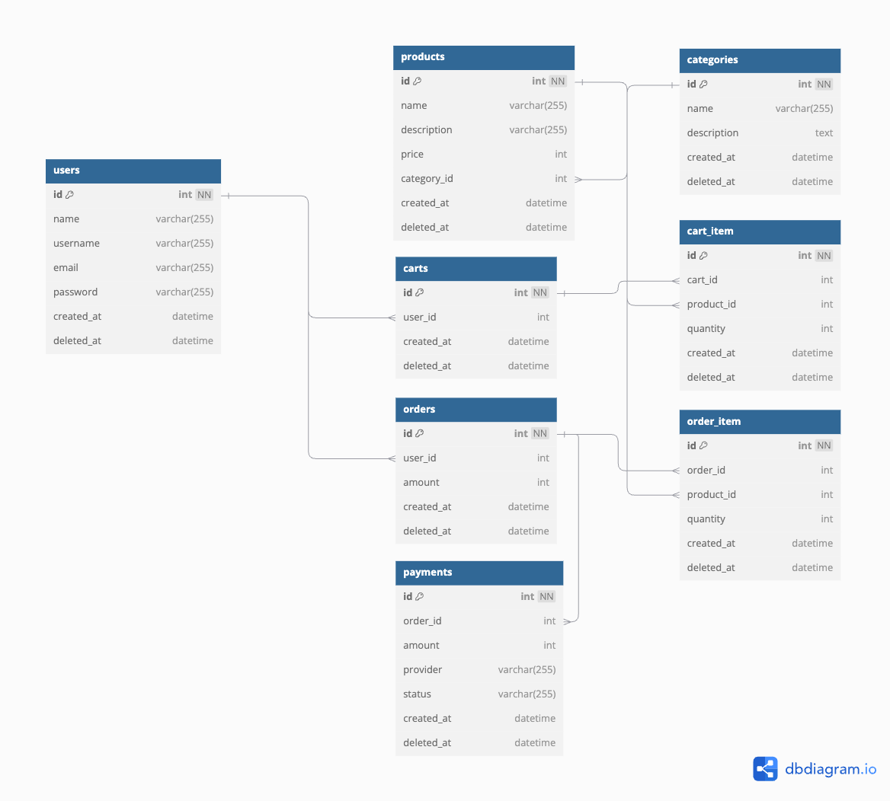

# synapsis-challenge

## Table of Contents
1. [Introduction](#introduction)
2. [Entity Relationship Diagram](#entity-relationship-diagram)
3. [Endpoints](#endpoints)
   - GET `/users`
   - POST `/login`
   - POST `/register`
   - GET `/products`
   - GET `/products/:category-id`
   - GET `/payments`
   - POST `/payments`
   - GET `/orders`
   - GET `/order-items`
   - POST `/orders`
   - GET `/carts`
   - GET `/cart-items/:user-id`
   - POST `/cart-items`
   - DELETE `/cart-items/:id`
4. [Link Deployment](#link-deployment)
5. [Contact](#contact)

## Introduction
This is part of challenge for internship backend engineer position in Synapsis.id

## Entity Relationship Diagram


## Endpoints

### 1. GET /users
Retrieve a list of all users.

- **URL**: `/users`
- **Method**: `GET`
- **Response**:
  ```json
  [
    {
      "id": 1,
      "name": "John Doe",
      "username": "johndoe",
      "email": "john.doe@example.com",
      "password": "$2a$14$m5cYrRGrrS0.o1Fnbo7IA.ikmq2DAakAn5K6pQjiAk0PNgXU/hSOy"
      "created_at": "2024-12-05 03:19:54"
      "deleted_at": null
    }
  ]
  ```

### 2. POST /login
Login to an account

- **URL**: `/login`
- **Method**: `POST`
- **Body**:
  ```json
  {
    "email": "ikanikan@example.com",
    "password": "ikan123"
  }
  ```
- **Response**:
  ```json
  {
    "message": "Login success"
  }
  ```

### 3. POST /register
Register an account

- **URL**: `/register`
- **Method**: `POST`
- **Body**:
  ```json
  {
    "username": "ikanikan",
    "email": "ikanikan@example.com",
    "password": "ikan123"
  }
  ```
- **Response**:
  ```json
  {
    "id": 1,
    "name": "John Doe",
    "username": "johndoe",
    "email": "john.doe@example.com",
    "password": "$2a$14$m5cYrRGrrS0.o1Fnbo7IA.ikmq2DAakAn5K6pQjiAk0PNgXU/hSOy"
    "created_at": "2024-12-05 03:19:54"
    "deleted_at": null
  }
  ```
  
### 4. GET /products
Retrieve a list of all products.

- **URL**: `/products`
- **Method**: `GET`
- **Response**:
  ```json
  [
    {
      "id": 1,
      "name": "Laptop",
      "description": null,
      "price": 1000,
      "category_id": 1,
      "created_at": null,
      "deleted_at": null
    },
    {
      "id": 2,
      "name": "Smartphone",
      "description": null,
      "price": 700,
      "category_id": 1,
      "created_at": null,
      "deleted_at": null
    },
    ...
  ]
  ```
  
### 5. GET /products/:category_id
Retrieve a list of all products by category.

- **URL**: `/products/2`
- **Method**: `GET`
- **Response**:
  ```json
  [
    {
      "id": 4,
      "name": "T-Shirt",
      "description": null,
      "price": 20,
      "category_id": 2,
      "created_at": null,
      "deleted_at": null
    },
    {
      "id": 5,
      "name": "Jeans",
      "description": null,
      "price": 50,
      "category_id": 2,
      "created_at": null,
      "deleted_at": null
    }
  ]
  ```
  
### 6. GET /payments
Retrieve a list of all payments.

- **URL**: `/payments`
- **Method**: `GET`
- **Response**:
  ```json
  [
    {
      "id": 1,
      "order_id": 4,
      "amount": 2350,
      "provider": "Cash",
      "status": "Success",
      "created_at": "2024-12-05T03:58:45Z",
      "deleted_at": null
    }
  ]
  ```

  
### 7. POST /payments
Create a payment

- **URL**: `/payments`
- **Method**: `POST`
- **Body**:
  ```json
  {
    "order_id": 4,
    "amount": 2350,
    "provider": "Cash",
    "Status": "Success"
  }
  ```
- **Response**:
  ```json
  {
    "order_id": 4,
    "amount": 2350,
    "provider": "Cash",
    "Status": "Success"
  }
  ```

### 8. GET /orders
Retrieve a list of all orders.

- **URL**: `/orders`
- **Method**: `GET`
- **Response**:
  ```json
  [
    {
      "id": 1,
      "user_id": 3,
      "amount": 0,
      "created_at": "2024-12-05T03:51:14Z",
      "deleted_at": null
    },
    {
      "id": 2,
      "user_id": 3,
      "amount": 0,
      "created_at": "2024-12-05T03:53:33Z",
      "deleted_at": null
    },
    {
      "id": 3,
      "user_id": 3,
      "amount": 0,
      "created_at": "2024-12-05T03:54:14Z",
      "deleted_at": null
    },
    ...
  ]
  ```
  
### 9. GET /order-items
Retrieve a list of all order items.

- **URL**: `/order-items`
- **Method**: `GET`
- **Response**:
  ```json
  [
    {
      "id": 1,
      "order_id": 4,
      "product_id": 1,
      "quantity": 2,
      "created_at": "2024-12-05T03:55:28Z",
      "deleted_at": null
    },
    {
      "id": 2,
      "order_id": 4,
      "product_id": 5,
      "quantity": 1,
      "created_at": "2024-12-05T03:55:28Z",
      "deleted_at": null
    },
    ...
  ]
  ```
### 10. POST /orders
Create an orders by cart id. After create an order, all the cart items that inside cart id will be automatically deleted.

- **URL**: `/orders`
- **Method**: `POST`
- **Body**:
  ```json
  {
    "id" 3
  }
  ```
- **Response**:
  ```json
  {
    "id": 4,
    "user_id": 3,
    "amount": 2350,
    "created_at": "2024-12-05T03:55:28Z",
    "deleted_at": null
  }
  ```
  
### 11. GET /carts
Retrieve a list of all carts.

- **URL**: `/carts`
- **Method**: `GET`
- **Response**:
  ```json
  [
    {
      "id": 1,
      "user_id": 3,
      "created_at": "2024-12-05T03:19:54Z",
      "deleted_at": null
    },
    {
      "id": 2,
      "user_id": 4,
      "created_at": "2024-12-06T23:36:57Z",
      "deleted_at": null
    }
  ]
  ```

### 12. GET /cart-items/:user-id
Retrieve a list of all cart items based on user id.

- **URL**: `/cart-items/3`
- **Method**: `GET`
- **Response**:
  ```json
  [
    {
      "id": 4,
      "cart_id": 1,
      "product_id": 3,
      "quantity": 2,
      "created_at": "2024-12-06T23:46:25Z",
      "deleted_at": null
    },
    {
      "id": 5,
      "cart_id": 1,
      "product_id": 5,
      "quantity": 1,
      "created_at": "2024-12-06T23:46:32Z",
      "deleted_at": null
    }
  ]
  ```

### 13. POST /cart-items
Create a cart item

- **URL**: `/cart-items`
- **Method**: `POST`
- **Body**:
  ```json
  {
    "cart_id": 1,
    "product_id": 5,
    "quantity": 1
  }
  ```
- **Response**:
  ```json
  {
    "id": 6,
    "cart_id": 1,
    "product_id": 5,
    "quantity": 1,
    "created_at": "2024-12-06T23:54:50.936215344Z",
    "deleted_at": null
  }
  ```

### 14. DELETE /cart-items/:cart-item-id
Delete a cart item

- **URL**: `/cart-items/6`
- **Method**: `POST`
- **Response**:
  ```json
  {
    "message": "Data has been deleted"
  }
  ```

## Link Deployment
```
http://44.203.66.185/
```

## Contact

Muhammad Akmal Arifin - makmalarifin25@gmail.com.com
